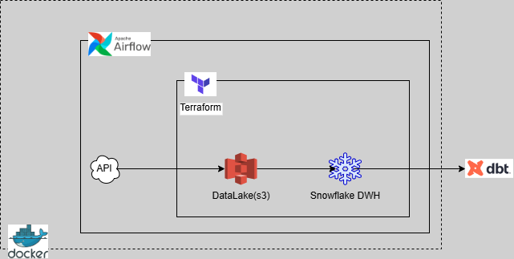

# CDE CAPSTONE PROJECT

This project is a requirement for the completion of the **CDE BootCamp Cohort 1** and encompasses a majority of all the tools and technologies (which include 
`Docker`, `Airflow`, `Terraform`, `Cloud-AWS`, `Snowflake`, `dbt`) learnt during the course of the program.

## OVERVIEW
A Travel Agency reached out to Core Data Engineers(CDE), their business model involves recommending tourist location to their customers based on different data 
points, I have been approached by management to build a Data Platform that will process the data from the Country rest API [here](https://restcountries.com/v3.1/all) 
into their cloud based Database/Data Warehouse for predictive analytics by their Data Science Team.

### METHODOLOGY

After careful consideration, I decided to build the Data Platform leveraging `Docker` to host the Orchestration tool, `Airflow` which would extract the raw 
data from the Country API and load it into an AWS DataLake, `s3`. Some columns have been requested by the Data Science Team of the Travel Agency to aid their 
analysis. These columns are selected and transformed into an `Object Storage` in the DataLake. The transformed columns are then loaded into a `Snowflake` Data 
WareHouse/Database. `dbt` is used to access the Data WareHouse to aid transforming and modelling of the data into `Fact` and `Dimension` tables. `Terraform` was 
used as an IaC service to provision the necessary resources in `AWS` and `Snowflake`.

#### Architecture diagram 

#### Tools used and their functions

#### Terraform:
Terraform leverages code to build infrastructures. In this project, it has been used to setup to providers namely; AWS and Snowflake. In AWS cloud, `IAM` service 
having `user`, `policy`, `access key`, `secret key` resources and `s3` service having a `bucket` resource were provisioned. While `database`, `schema`, `file format` 
`stage` and `table` resources were provisioned for Snowflake. The terraform statefile containing all the provisioned resources is stored in an AWS s3 bucket that 
was manually created.

#### Docker:
Docker was used to containerize Airflow by building from an Apache Airflow image found [HERE](https://airflow.apache.org/docs/apache-airflow/stable/howto/docker-compose/index.html).
A `Dockerfile` and `requirement.txt` was used to enhance the base image provided by Airflow to include the `awswrangler` package.

#### Airflow:
Airflow, an open-source technology served as the Orchestration tool and had the dag dependencies on the worker nodes set up to trigger at a scheduled interval 
which can be accessed on the web server GUI.

#### AWS-Cloud:
AWS is the preferred cloud provider for this project because of its accessibilty, compatibility with Terraform and ease of use. An IAM user was provisioned for 
Airflow attaching the necessary policy (using the principle of less-privilege) to have access to the DataLake (s3 bucket) using the access key and secret key 
parameters saved in the SSM parameter store.

#### Snowflake:
A snowflake data warehouse was provisioned because of its easy integration with other cloud service providers (in this case, AWS). In the data warehouse, a database 
was created having a schema that has a stage, staging table and file format within it to store the required (or extracted) data from the DataLake.

#### dbt:
dbt - Data Build Tool is used for data transformation within a data warehouse and allows the ELT (Extract, Load, Transform) principle which is used in this 
project. dbt was intergrated to Snowflake DW and used to carry out the necessary transformations that created the required fact and dimension tables for the 
Travel Agency.

### Process

- Terraform is used to build all the infrastructures asides `dbt`. The command *terraform init* is ran in the `infrastructure` folder which contains the `provider.tf`,
`aws_iam.tf`, `aws_s3.tf`, `snow_database.tf`, `snow_schema.tf`, `snow_format.tf`, `snow_stage.tf`, `snow_table.tf` and `backend.tf` files. After which 
*terraform plan* and *terraform apply* commands are used to set up the infrastructures. A terraform state file, `terraform.tfstate` is generated after the 
infrastructures have been provisioned and is stored in an external AWS s3 bucket for tracking state changes.

- Airflow is then setup using the `docker-compose.yaml` file which contains a built image from the `Dockerfile` and `requirements.txt` files. After the containers 
from the build have been confirmed to be in a healthy state, the Airflow GUI is then accessed via `https://localhost:8080`. On logging into the webserver page, 
access the *Admin|Variable* section to input variables for the Airflow IAM user access and secret keys to be used for connecting to AWS cloud via `aws_session()`. 
Also, access the *Admin|Connections* section to setup Snowflake connection by inputting the required parameters as obtained from the Snowflake DWH.

*Note:* The dag and task dependences to run in Airflow is initiated in the `capstone_prj_dag.py` file.

- The Snowflake DWH is accessed to confirm that the resources provisioned were in place.

- Within the project folder, *dbt init* is run, which initializes the `dbt` tool by inputting the required arguments to establish connection to the Snowflake DWH. 
In the models folder are two sub-folders, *staging* and *processed*, which contain different `sql` files that read to the required transformations and creates the 
following tables, `travel_agency`, `updated_travel_agency`, `fact_country`, `dim_country`, `dim_region`, `dim_sub_region`, `dim_independence`, `dim_un_member` 
and `dim_continents` in the DWH for the Travel Agency company by running *dbt run*. Also, within the test folder, a generic test (`string_not_empty`) was created. 
Generic and custom test were carried out on specified columns within the models to ensure the columns were not empty, unique and accepted only some particular 
values by running *dbt test*.

After all of the above processes have been put in place, Airflow scheduler was then triggered manually to run the whole orchestration. 
(Note: within the DAG, the pipeline has been scheduled to run daily at 12am).

### Conclusion
This project has helped me to solidify my knowlegde around Data Engineering leveraging the tools above.

### Extras
The CI/CD integrations can be found in the `.github` folder.
- CI carries out checks on code linting to ensure code written follow best practices.
- CD carries out the Build and Push of the code that Extract and Write to object storage to a Cloud based Container Registry.

**N.B:** The instructions and deliverables for this project are as seen in the `project_README.md` file.
